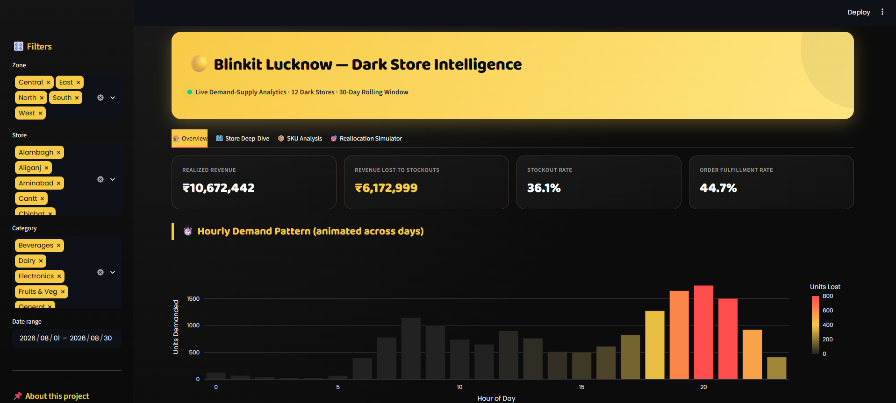
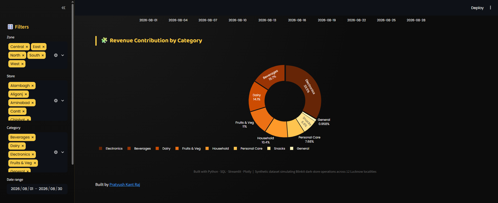
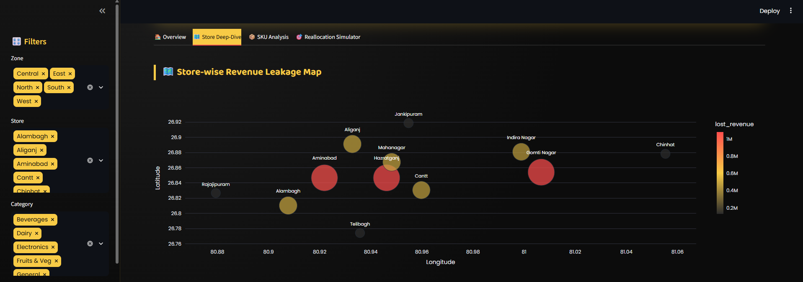
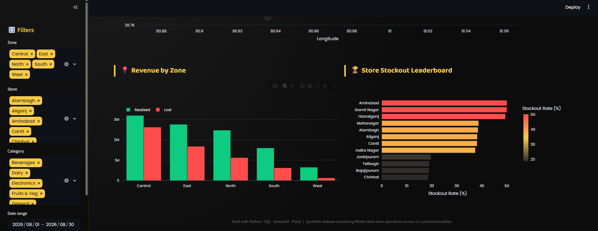
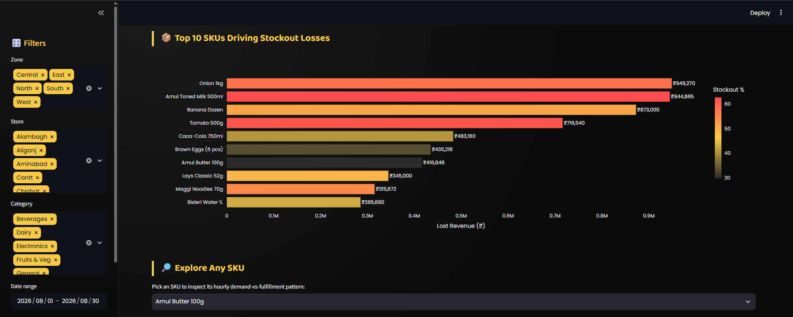
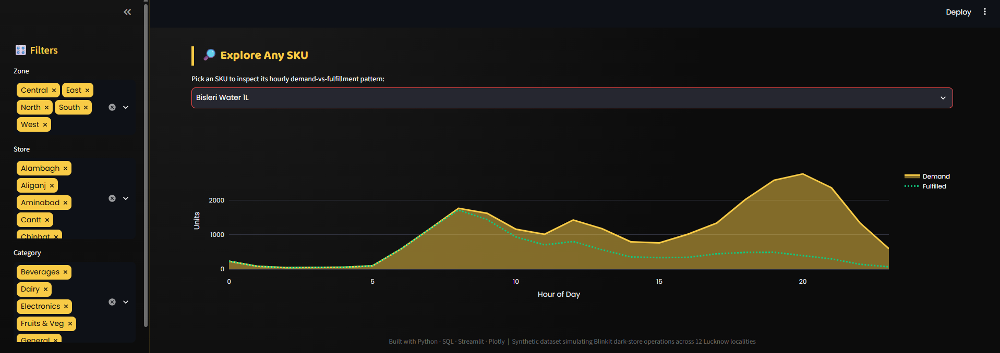
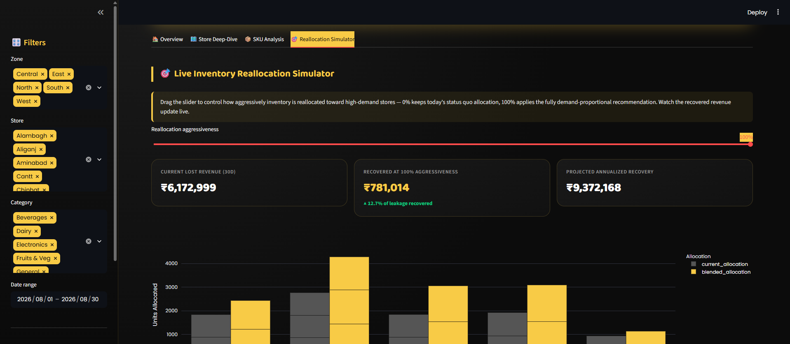
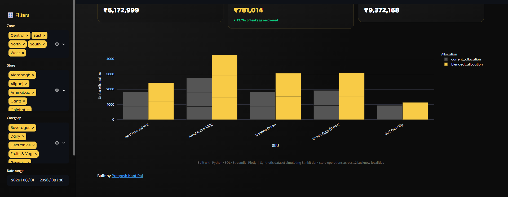

# 🟡 Blinkit Dark Store Analysis 

**Dark Store Demand-Supply Mismatch & Inventory Allocation Simulator**

A data analytics project simulating 12 Blinkit-style dark stores across Lucknow, quantifying how much revenue is lost to inventory stockouts, and modeling a smarter, demand-proportional inventory reallocation strategy to recover that revenue — visualized through a fully interactive Streamlit dashboard.

Built with **Python · SQL (SQLite) · Streamlit · Plotly**

🔗 **Live Demo:** [https://blinkit-lucknow-dark-store-analysis.streamlit.app/]

---

## 📊 Key Results

| Metric | Value |
|---|---|
| Dark stores simulated | 12 (across 5 zones in Lucknow) |
| Total orders analyzed | 94,329 |
| Revenue lost to stockouts (30 days) | **₹61,72,999** |
| Overall stockout rate | **36.1%** |
| Recoverable via smarter allocation | **₹7,81,014 (12.7% of leakage)** |
| Projected annualized recovery | **₹93,72,168** |

---

## 📸 Dashboard Screenshots

### Overview — Live KPIs & Hourly Demand Pattern


### Overview — Revenue Contribution by Category


### Store Deep-Dive — Revenue Leakage Map


### Store Deep-Dive — Zone Comparison & Stockout Leaderboard


### SKU Analysis — Top SKUs Driving Stockout Losses


### SKU Analysis — Explore Any SKU


### Reallocation Simulator — Live "What-If" Slider


### Reallocation Simulator — Allocation Comparison Chart


---

## 🧠 What This Project Does

1. **Simulates** 30 days of hourly order and inventory data across 12 real Lucknow localities (Gomti Nagar, Hazratganj, Indira Nagar, Aliganj, Alambagh, Chinhat, Mahanagar, Aminabad, Rajajipuram, Telibagh, Jankipuram, Cantt), spanning 18 SKUs across 6 categories.
2. **Quantifies** revenue lost to stockouts using SQL (joins, window functions, CTEs) against a SQLite database.
3. **Models** a demand-proportional inventory reallocation strategy in Python and estimates recoverable revenue.
4. **Visualizes** everything in an interactive, Blinkit-branded Streamlit dashboard with a live drag-slider reallocation simulator.

## 🗂️ Project Structure


```text
Blinkit-Dark-Store-Analysis/
│
├── data/
│   ├── *.csv                  # Synthetic datasets
│   └── blinkit.db             # SQLite database
│
├── scripts/
│   ├── generate_data.py       # Generate synthetic data
│   ├── build_database.py      # Load CSVs into SQLite
│   └── allocation_engine.py   # Inventory reallocation model
│
├── sql/
│   └── analysis_queries.sql   # 8 analytical SQL queries
│
├── dashboard/
│   ├── app.py                 # Streamlit dashboard
│   └── requirements.txt       # Dashboard dependencies
│
├── screenshots/               # Dashboard images for README
│
├── README.md
└── LICENSE
```

## ⚙️ How to Run Locally

```bash
# 1. Clone the repo
git clone https://github.com/PratyushRaj0512/BlinkIt-Dark-Store-Analysis.git
cd BlinkIt-Dark-Store-Analysis

# 2. Set up a virtual environment
python -m venv venv
venv\Scripts\activate        # Windows
source venv/bin/activate     # Mac/Linux

# 3. Install dependencies
pip install pandas numpy streamlit plotly

# 4. Generate the dataset and build the database
cd scripts
python generate_data.py
python build_database.py
python allocation_engine.py

# 5. Launch the dashboard
cd ../dashboard
pip install -r requirements.txt
streamlit run app.py
```

The dashboard opens at `http://localhost:8501`.

## 🔍 Explore the SQL

Open `data/blinkit_lucknow.db` (created in step 4 above) in [DB Browser for SQLite](https://sqlitebrowser.org/) and run the queries in `sql/analysis_queries.sql` — includes store-wise lost revenue, SKU-level stockout rates, 7-day rolling demand trends (window functions), and category-level revenue contribution.


**Built by [Pratyush Raj](https://github.com/PratyushRaj0512)**
